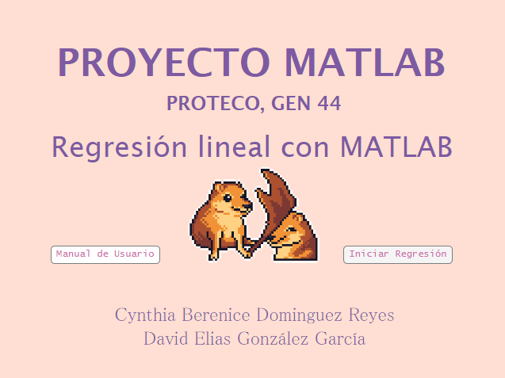
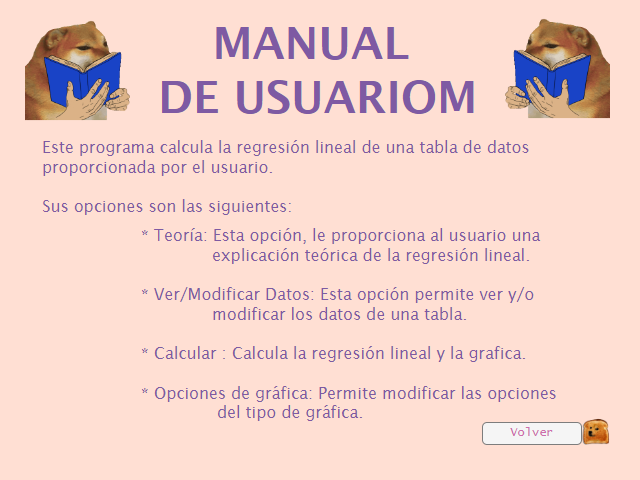
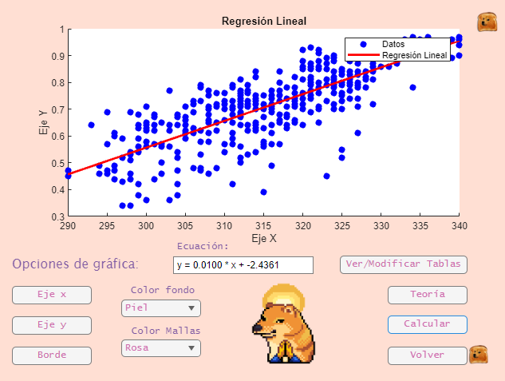
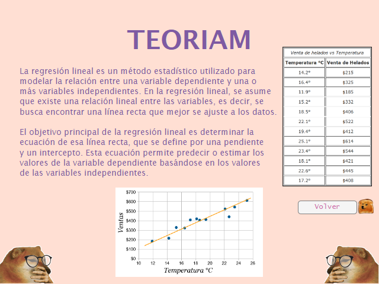
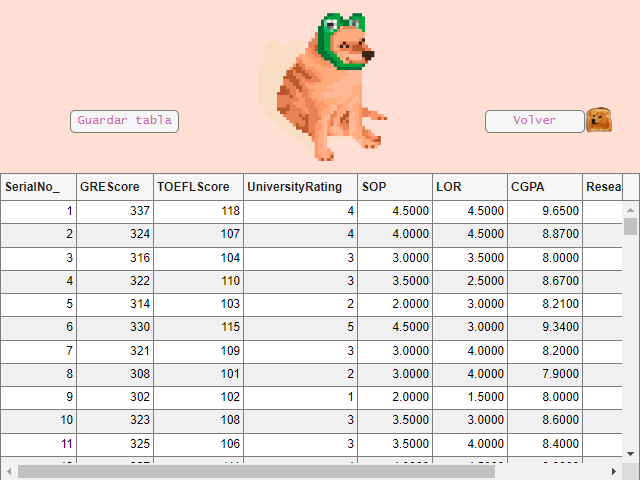

  

# Matlab APP 🌌
This is a MATLAB project using App designer, for PROTECO's course: Matlab.

### Project objetives 📈
Implement a model of a simple lineal regretion in a graphic interface from MATLAB using App Designer.

### Description 📖
This project consist in the deliver of a graphic interface, so it have to present the data, and analyse that data.

### How to beggin with. 😸

This app made with App designer, offer you a simple way to do a linear regression, but it initiate with the home page by just opening the `Proyecto` file:

  

Of which you'll indicate if you want to see the user manual or beggin with the app.

Later on, the graphic menu displays, where you can indicate to see the theory behind it, modify the graphic display, modify the tables, and calculate them.

### Manual de usuario
On this section, you can see the instructions of how to use this software,

  

### Grafica
On this section, you can make the linear regression, and modify the graph settings :)

  

### Teoriam
On this section, you can learn how it is made in theory the linear regression :0

  

### Datos
On this section, you can see and change the data from the columns and rows :B

  

